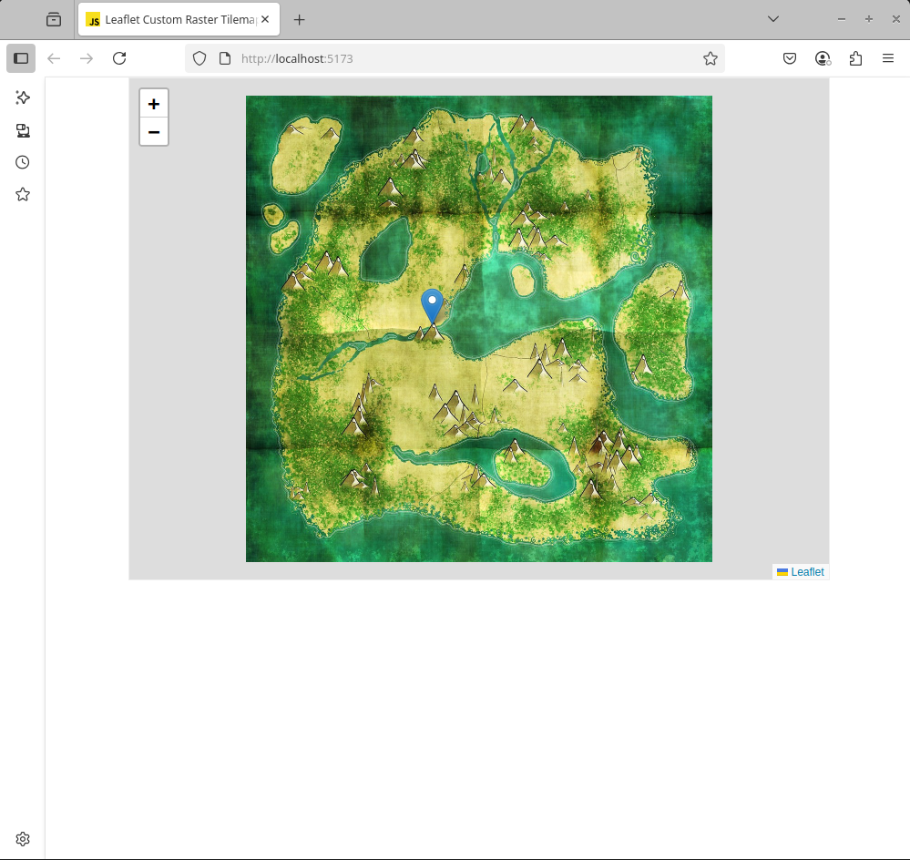

# Leaflet Raster to Tiles Example

This is a sample code for using a large image as a map tile in Leaflet.

For an in-depth tutorial on how to make this, check out this [blog post](https://jereme.me/post/custom-image-map-leaflet/).



## Requirements

- GDAL
- Python with GDAL Bindings

## Setup

1. Install pacakges

```sh
npm install
```

2. Run the following then open the URL provided in the browser.

```sh
npm run dev
```
